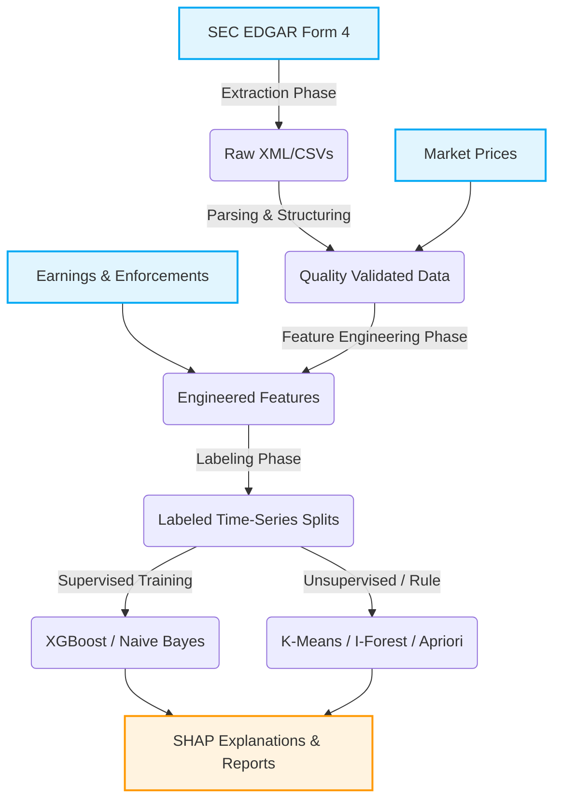

#  SEC Form 4 Insider Trading Analysis


> An end-to-end Machine Learning pipeline designed to extract, engineer, and analyze SEC Form 4 filings to detect anomalous patterns and potential illegal insider trading activities. 

##  Mission Statement

This repository houses a comprehensive data engineering and machine learning architecture that transforms complex, unstructured SEC Form 4 filings into powerful behavioral insights. By combining supervised anomaly classification (XGBoost, Naive Bayes), unsupervised clustering (K-Means, Isolation Forest), and rule-based association (Apriori), this system identifies structural data asymmetries and flags suspicious executive trading patterns.

**Developed By:** 
* Naman Alex Xavier - [namanalex@gmail.com](mailto:namanalex@gmail.com)
* Joel Josy - [joeljosy79@gmail.com](mailto:joeljosy79@gmail.com)

---

## Key Innovations & Features

- **Automated SEC EDGAR Ingestion:** Robust extraction pipeline for Form 4 XML filings, handling rate-limiting and complex financial data schemas.
- **Multidimensional Feature Engineering:** Constructs temporal, network, textual, and trading-based features (e.g., Cohen patterns, 10b5-1 plan overrides).
- **External Data Fusion:** Integrates market pricing context (Yahoo Finance) and external ground-truth events (SEC enforcement actions, Earnings declarations) for precise time-horizon labeling.
- **Multi-Model Evaluation Track:**
  - *Supervised Learning:* XGBoost (with SHAP interpretability) & Naive Bayes.
  - *Unsupervised/Anomaly Detection:* Isolation Forest & K-Means for structural clustering.
  - *Pattern Mining:* Fuzzy scoring & Apriori association rules.
- **Explainable AI (XAI):** Built-in SHAP visualizations and post-hoc validation utilities to interpret model decisions, moving beyond "black-box" predictions.
- **Scalable Architecture:** Capable of handling multi-ticker batch runs, backed by an optional PostgreSQL relational schema for large-scale analytics.

---

## Architectural Workflow



---

## Technology Stack

- **Core & Data Processing:** Python 3.11+, Pandas, NumPy
- **Machine Learning & NLP:** Scikit-Learn, XGBoost, SpaCy, NLTK, TextBlob
- **Model Explainability:** SHAP, LIME
- **Data Acquisition:** sec-edgar-downloader, yfinance, BeautifulSoup4, LXML
- **Database Architecture:** PostgreSQL, SQLAlchemy, Psycopg2
- **Visualization:** Plotly, Matplotlib, Seaborn
- **Testing & Tooling:** PyTest, PyYAML, Python-Dotenv, tqdm

---

## Repository Structure

```text
insider-trading-analysis/
├── config/             # YAML configurations (tickers, parameters)
├── data/
│   ├── raw/            # Downloaded SEC XML filings
│   ├── processed/      # Engineered and labeled data splits
│   └── external/       # Market pricing and SEC enforcement data
├── models/             # Serialized joblib artifacts (models/scalers)
├── reports/            # Auto-generated JSON/MD validation & metrics
├── scripts/            # Bash & Python orchestration entrypoints
├── sql/                # DB relational schemas
└── src/
    ├── data/           # Extraction, market data, external events
    ├── features/       # Temporal, text, network feature generation
    ├── labels/         # Cohen heuristic & 10b5-1 labeling logic
    ├── models/         # Multi-model core architectures (XGB, Apriori, etc.)
    └── utils/          # Project-wide loggers and cross-validation utilities
```

---

## Setup & Installation

**1. Clone the repository and initialize the Python environment (3.11/3.12 recommended):**
```bash
git clone https://github.com/your-username/insider-trading-analysis.git
cd insider-trading-analysis
python -m venv .venv
source .venv/bin/activate  # On Windows use: .venv\Scripts\activate
```

**2. Install project dependencies:**
```bash
pip install --upgrade pip
pip install -r requirements-lock.txt
```

**3. Configure environment variables:**
Create a `.env` file in the root directory for your database configuration (if opting to use PostgreSQL):
```env
DB_HOST=localhost
DB_PORT=5432
DB_NAME=insider_trading_db
DB_USER=postgres
DB_PASSWORD=your_password
```

---

## End-to-End Execution

The pipeline is heavily modular. You can orchestrate multi-ticker runs universally or process specific tickers stepwise.

### Batch Orchestration
For the fastest way to run the entire pipeline across configured tickers:
```bash
bash scripts/run_pipeline.sh
```

### Step-by-Step Analysis (Example: AAPL)
**1. Extract SEC Filings**
Extract raw Data from SEC EDGAR.
```bash
python -m src.data.extract --ticker AAPL --num-filings 500
```
**2. Data Quality Profiling**
Generates `.json` and `.md` reports ensuring schema integrity.
```bash
python -m src.data.quality --csv data/processed/AAPL_form4.csv
```
**3. Feature Engineering**
Generates core technical, chronological, and text-sentiment features.
```bash
python -m src.feature.pipeline --input data/processed/AAPL_form4.csv
```
**4. External Events Ingestion**
Fetch critical timeline hooks like earnings schedules and enforcement flags.
```bash
python -m src.data.external_events --tickers AAPL
```
**5. Phase 3 Labeling**
Label historical entries utilizing custom Cohen heuristics & SEC plan overrides.
```bash
python -m src.labels.pipeline --input data/processed/AAPL_form4_features.csv
```
**6. Data Splitting**
Merge multi-ticker processed data and allocate time-based train/validation/test sets.
```bash
python scripts/create_splits.py
```

---

## Model Training & Validation

Once split arrays reside in `data/processed/`, core learning endpoints evaluate predictive accuracy against standard and anomaly horizons.

**Train Models:**
```bash
# Supervised Classification
python -m src.models.xgb_model
python -m src.models.naive_bayes_model

# Anomaly Detection & Clustering
python -m src.models.isolation_forest_model
python -m src.models.kmeans_model

# Scoring & Rule Inference
python -m src.models.fuzzy_model
python -m src.models.apriori_model
```

**Analysis & Post-hoc Explanability Validation:**
Unveil critical model logic and visualize feature importance across distinct stock sectors:
```bash
python -m src.models.cross_validate
python -m src.models.ablation
python -m src.models.posthoc_validation
python -m src.models.sector_analysis
```

Models output trained serialized artifacts to `models/` and robust metric reports (`.json`) alongside `.png` graphs (like SHAP beeswarm or Apriori ROCs) internally to the `reports/` directory.

---
